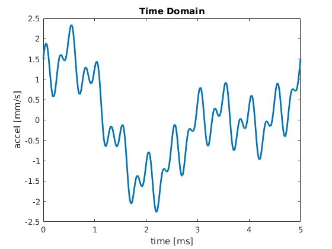

# Titel 

| Name | Matrikelnummer |
| - | - |
| Otto Oswald | 123 |
| Anna Ahrend | 321 |
| Helga Himmel | 313 |

## Projektbeschreibung

> Beschreiben Sie hier hier Projekt, gegebenenfalls mit Quellenangaben. Um Bilder verwenden zu können, fügen sie sie ihrem Repository hinzu und referenzieren Sie sie hier:
>  
> 

>
>  Werfen Sie einen Blick in das [Markdown Cheatsheet](https://github.com/adam-p/markdown-here/wiki/Markdown-Cheatsheet) um die Formatierung von Text in `*.md` Dateien zu verstehen. 
>
> Alle Zeilen dieses Dokuments, die mit `>` beginnen, dienen Ihnen als Hilfestellung und können gelöscht werden.

## Zielsetzung

 > Welche konkrete Frage wollen Sie beantworten, bzw. welches konkrete Problem wollen Sie lösen?

 ## Anwendungsorientierte Einbettung in die Veranstaltung

 > Wieso hat ihr Projekt mit Modellbildung und Simulation zu tun

 ## Potentielle Risiken

 > Wo sehen Sie in ihrem Projekt die größten Risiken bzw. Bürden? Gibt es einen Plan B, falls sie ein risikoreiches Teilziel nicht rechtzeitig erreichen?