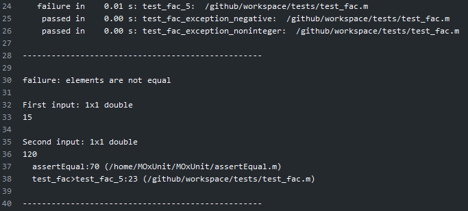
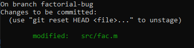

# Modellbildung und Simulation 2 - Projektbeschreibung

:loudspeaker: **Lesen Sie dieses Dokument vollständig bis zum Ende!** :loudspeaker:


## Inhalt der Aufgabe

 - Sie demonstrieren, dass Sie mit git vertraut sind.
 - Sie erhalten Einblick in automatisierte Software-Tests
 - Sie verfassen eine Projektbeschreibung für Ihre Ausarbeitung


## Abgabe

**Wichtig:** Die Abgabe dieser Übung erfolgt über den Issue Tracker dieses repositories. 

 - Erstellen Sie _mit genügend Puffer vor Ablauf ihrer Deadline_ ein Issue mit dem Titel `Projektbeschreibung absegnen` und weisen es mir (@joergbrech) zur Bearbeitung zu. Bei der Gelegenheit überprüfe ich auch, ob sie die Schritte aus Aufgabe 1.1 richtig befolgt haben.


:point_right: **Erst wenn ich explizit die Projektbeschreibung abgesegnet habe, gilt die Aufgabe als bestanden! Das Erstellen des Issues alleine reicht nicht!** :point_left:

## Ihr Team

Auf Github sind sie nun Mitglied eines Teams. Nutzen Sie Github zur Kommunikation mit ihren Teammitgliedern

<p align="center"></p>

## Ihre Aufgabe

### Vorarbeit in Eigenregie:

 - Machen Sie sich mit dem [Versionskontroll](https://de.wikipedia.org/wiki/Versionsverwaltung)system [git](https://git-scm.com/) vertraut und installieren Sie es auf ihrem Rechner. 
    - Historisch bedingt ist git ein Kommandozeilenprogramm ohne graphische Oberfläche. Für Windows, Linux und Mac gibt es inzwischen einige gute graphischen Oberflächen, z.B. [Tortoise Git](https://tortoisegit.org/) für Windows. 
    - In dieser Übung finden aber **nur die Kommandozeilenbefehle** Erwähnung. Um als Windows Nutzer git aus der Kommandozeile verwenden zu können, benutzen sie die [git bash](https://gitforwindows.org/), oder noch besser: Installieren Sie sich eine [Linux Distribution als Subsystem](https://docs.microsoft.com/de-de/windows/wsl/install-win10), z.B. `Ubuntu 18.04`.
    - Auf welche Weise sie git bedienen, bleibt Ihnen überlassen.
 - Machen Sie sich mit dem Arbeiten auf Github vertraut, insbesondere mit dem Issue Tracker und Pull Requests. Als Erinnerungsstütze finden Sie weiter unten unter "Zusatzinformationen" ein Beispiel. In Aufgabe 1.1 wird es darum gehen, diesen Beispiel-Workflow einmal durchzuarbeiten.
 - Hier finden Sie einige git und Github Tutorials:
    - https://guides.github.com/introduction/git-handbook/
    - https://www.atlassian.com/de/git
    - https://lab.github.com/githubtraining/introduction-to-github
 - Legen Sie mit Aufgabe 1.1 los, sobald Sie folgende Fragen beantworten können:
   - Wozu wird git verwendet?
   - Was ist der Unterschied zwischen git und Github?
   - Was ist ein repository?
   - Was verbirgt sich hinter den Begriffen "commit", "branch" und "Staging Area" und "merge conflict"?
   - Was machen die Befehle `git clone`, `git pull`, `git push`, `git add`, `git commit`, `git checkout`, `git merge`?
   - Wer oder was ist Linus Tovalds?

Die folgenden beiden Aufgaben bauen nicht aufeinander auf und können parallel, bzw. in einer beliebigen Reihenfolge bearbeitet werden.

 ### Aufgabe 1.1: Bugfix und automatische Tests

 - Mit jedem *push* in dieses repository werden automatische Tests für den Programmcode im `src` Verzeichnis durchgeführt. An dem roten Kreuz nebem dem letzten *commit* stellen Sie fest, dass mindestens einer der Tests nicht erfolgreich war:
   
   

   Sie erhalten zusätzliche Detailinformationen:

   

   Wir lesen die Information von unten nach oben. 
    - Zeile 38: Zeile 23 von [`tests/testfac.m`](tests/test_fac.m), im Funktionskörper der Funktion `test_fac_5` ist die Ursache des Fehlers.
    - Zeile 37: Offensichtlich wurde in Zeile 23 von [`tests/testfac.m`](tests/test_fac.m) die Funktion `assertEqual` aufgerufen, die den Fehler verursacht hat. Diese Funktion ist in Zeile 70 von `assertEqual.m` definiert, das interessiert uns aber weniger.
    - Zeilen 30-36: Die Funktion `assertEqual` hat zwei Eingaben bekommen, von  denen erwartet wurde, dass sie gleich sind. Offensichtlich sind sie es aber nicht: Die erste Eingabe ist 15, die zweite ist 120. 
    - Es ist Zeit sich den Test genauer anzuschauen:

      https://github.com/joergbrech/modsim2-projektbeschreibung/blob/3201fc1044e119ea0e818a64289d4a9f065efae3/tests/test_fac.m#L21-L23

      Offensichtlich wird getestet, ob `fac(5)` 120 ergibt. Tatsächlich liefert die Funktion aber 15 als Rückgabewert für die Eingabe 5. Offenslicht hat die Funktion `fac`, die in [`src/fac.m`](src/fac.m) definiert ist einen bug.

 - Wechseln Sie auf den Issue Tracker und eröffnen ein Issue, das das Problem möglichst treffend beschreibt.

   

   Das erstellte Issue kriegt eine laufende Nummer zugewiesen. Unter der Annahme, dass es das erste Issue ihres repositories ist, ist dies `#1`. Mit diesem hashtag können Sie sich in Kommentaren und commit messages auf das Issue beziehen.
 - Es ist Zeit den bug zu beheben. Wechseln Sie auf die Hauptseite dieses repositories und klicken auf "Clone or Download"

   
 - Kopieren Sie sich den `hppts` Link auf ihr repository. 
   
 - Auf ihrem Rechner, öffnen Sie ein Kommandozeilenfenster (git bash, Ubuntu 18.04 WSL oder ein Terminal) und klonen Sie sich das Verzeichnis auf ihren lokalen Rechner.
   ```bash
   git clone https://github.com/octo-org/octo-repo.git
   ```
   wobei sie hier den Link *ihres* repositories verwenden. Es wird ein neuer Ordner angelegt, mit dem Namen `aufgabe1-projektbeschreibung-teamname`. Wechseln sie in diesen Ordner


   ```
   cd aufgabe1-projektbeschreibung-teamname
   ```

   und lassen Sie sich den Inhalt wieder geben:

   ```
   ls -la
   ```

   Sie erkennen, dass es sich bei dem Ordner um ein git-repository handelt daran, dass es einen Unterordner mit Namen `.git` gibt. In einem git-repository können Sie sich jederzeit den Status des repositories anschauen:

   ```
   git status
   ```

 - Erstellen Sie ein branch `factorial-bug` und wechseln Sie auf diesen:
 
   ```
   git checkout -b factorial-bug
   ```
   
   Alle Änderungen die sie nun in dem Ordner vornehmen finden nicht mehr im Hauptentwicklungszweig `master` statt, sondern in ihrem eigenen lokalen Zweig `factorial-bug`. 

 - Finden Sie den Fehler in `src/fac.m` und beheben Sie ihn. Sie können hierzu einen beliebigen Texteditor, Matlab oder Octave verwenden. Wenn sie die Tests in `tests/test_fac.m` lokal auf ihrem Rechner ausführen möchten, müssen sie sich vorher [MOxUnit](https://github.com/MOxUnit/MOxUnit) installieren, das ist aber nicht zwingend nötig.
 - Vergewissern Sie sich per Kommandozeile, dass nur die Datei `src/fac.m` geändert wurde:

   ```
   git status
   ```

   

   Sie können mit `git diff` alle vorgenommenen Änderungen sehen.

 - Fügen Sie alle geänderten Dateien der *Staging Area* hinzu

   ```
   git add .
   ```
   
   Überprüfen Sie den Status mit `git status`

   

 - *Commiten* sie alle Änderungen aus der Staging Area in ihren lokalen branch `factorial-bug` mit einer sprechenend commit Nachricht:

   ```
   git commit -m "fix bug in fac.m, addresses #1"
   ```
   
   Überprüfen Sie den Status mit `git status`

   

 - Es ist Zeit, ihre Änderungen in das *remote* repository auf Github zu *push*en. Dazu erstellen Sie einen branch auf dem nicht-lokalen repository auf github mit dem selben Namen wie ihr lokaler branch, `factorial-bug` und synchronisieren den lokalen und remote branch in einem Befehl:
   
   ```
   git push -u origin HEAD
   ```

 - Wechseln Sie wieder in den Hauptentwicklungszweig

   ```
   git checkout master
   ```
   Vergewissern sie sich, dass in diesem Zweig ihre Änderungen an `src/fac.m` fehlen.

 - Öffnen Sie ihr repository auf Github und wechseln Sie auf die *branches* Ansicht. Vergewissern Sie sich, dass es einen branch mit Namen `factorial-bug` gibt, der ihren *commit* enthält, und das nun alle automatischen Tests durchlaufen. Letzteres erkennen Sie am grünen Häkchen neben dem *branch* bzw. neben dem *commit*.

   

   Wenn Sie zufrieden sind, erstellen Sie einen "*Pull Request* auf den `master` branch" und wählen Sie auf der rechten Seite eines oder alle ihrer Teammitglieder als *Reviewer* aus.

   **Pro Tipp:** *Schreiben Sie `fixes #1` in die Beschreibung des Pull Requests. Dann wird Github automatisch das erstellte Issue schließen, sobald der Pull Request von ihren Teammitgliedern akzeptiert und gemerged wurde.*

 - Wenn Sie als Reviewer ausgewählt wurden, überprüfen sie die Änderung die ihr Teammitglied in ihrem Pull Request vorgenommen hat. Wenn sie zufrieden sind, wählen Sie "Approve Changes" und "Merge pull request" um alle Änderungen in den Hauptentwicklungszweig zu übernehmen.

 - Das Issue ist behoben und kann im Issue Tracker geschlossen werden.

 - Nun ist ihre lokale Kopie des `master` branch um einen commit hinter dem `master` branch auf Github. Vergewissern Sie sich, dass sie auf dem Hauptentwicklungszweig `master` sind und *pull*en sie sich alle Änderungen von dem *remote* repository auf Github in ihre lokale Kopie:

   ```
   git checkout master
   git pull
   ```

Ich lege Ihnen sehr ans Herzen, diesen Workflow für ihre Projektarbeit zu übernehmen. Arbeiten Sie mit dem Issue tracker. Vermeiden Sie *commit*s in den `master` branch. Arbeiten sie mit branches und *Pull Requests*. Schreiben Sie Tests für ihren Matlab-Code.

 ### Aufgabe 1.2: Projektbeschreibung

 In diesem Semester müssen Sie eine Projektarbeit in einem Team absolvieren. Sie suchen sich selbstständig eine Fragestellung oder ein Problem aus, welche(s) sich mit den Methoden aus den Vorlesungen Modellbildung und Simulation 1 und 2 beantworten bzw. lösen lässt. 

 In dieser Aufgabe geht es darum,
  -  sich ein Thema auszusuchen; Sie können sich gerne in [dieser Liste](https://gist.github.com/joergbrech/8f3d43a750bc44a0b49012ea43e7c119) Inspiration suchen
  - das Thema auszuformulieren und sich Gedanken über verwendete Literatur, Methoden und Software zu machen
  - sich einen groben Projektplan zumachen, das Projekt in kleinere Teilaufgaben aufzuteilen und sich Gedanken über mögliche Risiken und Stolperfallen zu machen.

 Füllen Sie die fehlenden Inhalte in der Datei [`PROJEKTBESCHREIBUNG.md`](PROJEKTBESCHREIBUNG.md) aus. Die Projektbeschreibung sollte ungefähr in der Größenordnung von zehn Sätzen sein. Verwenden Sie hierzu gerne den Pull Request Workflow aus Aufgabe 1.1 um die Datei im Team zu bearbeiten. Sobald Sie mit ihrer Projektbeschreibung fertig sind, eröffnen Sie bitte ein Issue im Issue Tracker mit dem Titel `Projektbeschreibung absegnen` und weisen es mir (@joergbrech) zur Bearbeitung zu. **Planen Sie genug Puffer vor der Deadline ein: Die Aufgabe gilt als erfüllt, wenn ich die Projektbeschreibung abgesegnet habe!**

## Troubleshooting

Wenn Sie Schwierigkeiten haben, öffnen Sie bitte im Issue Tracker ein neues Issue und weisen sie es mir (@joergbrech) zur Bearbeitung zu.

<p align="center"></p>

## Zusatzinformationen

<details>
<summary>Teamarbeit mit GIT</summary>

### Der Pull-Request Workflow

Sie arbeiten gemeinsam als Team an einem Projekt. Es empfiehlt sich vorab die Aufgaben zu verteilen. Der Issue Tracker bietet sich hier als unterstützendes Tool an.

Damit es möglichst zu wenigen Konflikten kommt, bietet es sich an, die Aufgaben so zu verteilen, dass man sich möglichst wenig in die Quere kommt. Am besten arbeitet ihr, in dem ihr **nur in seltenen Ausnahmen** direkt in den `master` branch commitet. Idealerweise folgt ihr dem Workflow mit Pull Requests:

Angenommen Maja möchte eine bestimmte Teilaufgabe bearbeiten, z.B. das Kapitel "Stand der Technik" in die Projektdokumentation einfügen.

 - Maja wechselt in ihrer lokalen Kopie des repositories auf den `master` branch und sorgt dafür, dass sie alle aktuellen Änderungen aus dem Github repository enthält:

   ```bash
   git checkout master
   git pull
   ```

 - Sie erstellt einen neuen lokalen branch mit einem sprechenden Namen, z.B. `maja/chapter-stand-der-technik`, und welchselt in diesen branch

    ```bash
    git checkout -b maja/chapter-stand-der-technik
    ```

 - Anschließend kann Maja Dateien ändern oder neue hinzufügen, und jede inkrementelle Änderung *commit*en.

    ```bash
    git add 02_stand_der_technik.tex
    git add main.tex
    git commit -m "Stand der Technik Kapitel geschrieben"
    ```

 - Sie kann jederzeit ihre lokalen Änderungen auf das Github repository *push*en. 
   Der Befehl

    ```bash
    git push -u origin HEAD
    ```

    erstellt einen neuen branch im *remote* Github repository mit dem selben Namen wie ihr lokaler branch. Wenn Sie weitere Änderungen an dem branch vornehmen möchte, muss sie beim nächsten mal nur noch 

    ```bash
    git push
    ```

    eingeben, da es schon im *remote* Github repository einen branch mit demselben Namen gibt.

 - Sobald Maja mit der Bearbeitung ihrer Teilaufgabe fertig ist, kann sie auf Github eine *Pull Request* stellen, und einen ihrer Teammitglieder, Willi, um einen *review* bitten. Wenn Willi mit Majas Änderungen einverstanden ist, kann er den *Pull Request* in den `master` branch *mergen*.

  - Sobald Maja's Änderungen im `master` übernommen sind, kann der branch `maja/chapter-stand-der-technik` ohne Bedenken gelöscht werden.

  - Falls Maja eine Aufgabe bearbeitet hat, die im Issue Tracker hinterlegt ist, kann das Issue als erledigt markiert werden.

</details>

<details>

<summary>Was gehört unter Versionskontrolle und was nicht.</summary>

### Stellen Sie folgende Dateien unter Versionskontrolle:

 - Alle von Menschen lesbare Dateien (ASCII), die sie zur Bearbeitung ihres Projektes erstellt haben. Das sind zum Beispiel `*.tex` Dateien oder `*.m` Dateien.
 - Binäre Dateien wie Bilder, die sie in ihrer Dokumentation verwenden.

### Stellen Sie folgende Dateien **nicht** unter Versionskontrolle:

 - Alle automatisch erstellten Dateien. Bei Latex sind das zum Beispiel Dateien mit der Endung `*.aux` oder `*.tmp`.
 - Große binäre Dateien, die sich regelmäßig ändern.

</details>

<details>

<summary>Automatische Tests</summary>

### Continuous Integration


Dieses repository ist so vorbereitet, dass mit jedem *push* und jedem *Pull Request* gewisse Aktionen automatisiert in der cloud durchgeführt werden, konkret werden unit tests für den Matlab Code in `src` durchgeführt. Diese automatisierten Aktionen sind wesentliche Bestandteile von [Continuous Integration](https://de.wikipedia.org/wiki/Kontinuierliche_Integration).

</details>

## Nützliche Links

 - [Git Cheatsheet](https://github.github.com/training-kit/downloads/github-git-cheat-sheet.pdf)
 - [Markdown Cheatsheet](https://github.com/adam-p/markdown-here/wiki/Markdown-Cheatsheet)
 - [Markdown Emoticons](https://gist.github.com/rxaviers/7360908)
